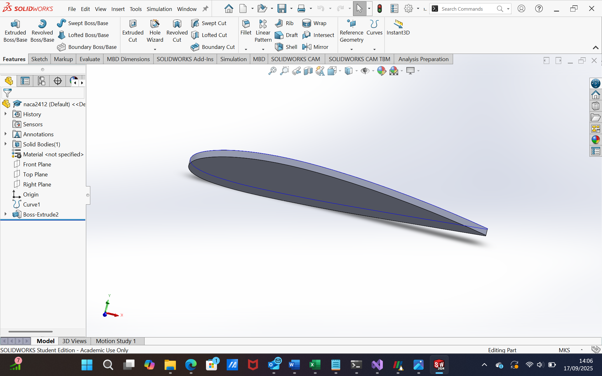
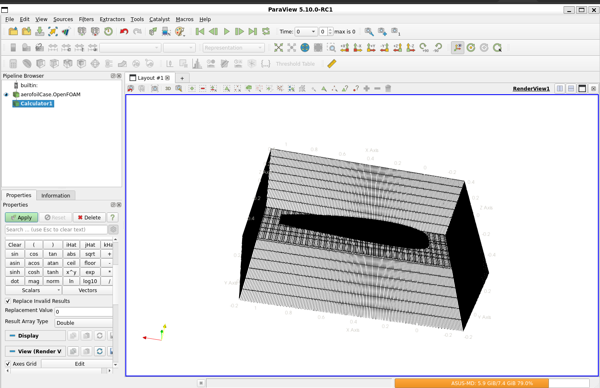
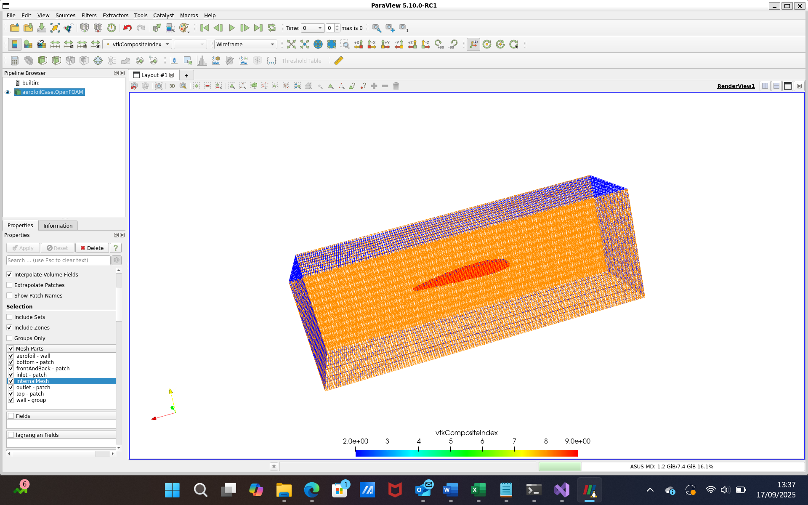

# Week 2 – Geometry Creation and Meshing

## Overview
In Week 2, I moved from theory and tutorials (Week 1) into practical CFD setup.  
The main tasks included:
1. Creating the NACA2412 aerofoil geometry in **SOLIDWORKS** using coordinates from the NACA database.
2. Exporting the geometry as an `.stl` file for use in OpenFOAM.
3. Generating the computational domain using `blockMesh`.
4. Using `snappyHexMesh` to refine the mesh around the aerofoil.
5. Visualizing the mesh in **ParaView**.

---

## Steps Completed

### 1. Geometry Creation in SolidWorks
- Imported the NACA2412 coordinates.
- Created the aerofoil profile and extruded into 3D.
- Exported the final geometry as `naca2412.stl`.

### 2. Preparing the Domain
- Defined a background box in `blockMeshDict` to represent the wind tunnel domain.
- Applied patches: inlet, outlet, top, bottom, frontAndBack.

### 3. SnappyHexMesh Refinement
- Configured `snappyHexMeshDict` to:
  - Import the STL geometry.
  - Refine cells around the aerofoil surface.
  - Keep `locationInMesh` inside the flow region.
- Ran `surfaceFeatures` to capture aerofoil edges.
- Applied multiple mesh checks with `checkMesh`.

### 4. Visualization in ParaView
- Confirmed that the aerofoil is correctly embedded in the mesh.
- Checked refinement around the aerofoil region.

---

## Screenshots (from SOLIDWORKS and ParaView)

### SOLIDWORKS Geometry

### Mesh Box with Embedded Aerofoil

### Refined Mesh in ParaView

---

## Outcome
- Successfully created and exported the NACA2412 geometry.
- Generated a structured background mesh with `blockMesh`.
- Applied local mesh refinement using `snappyHexMesh`.
- Verified mesh integrity using `checkMesh`.
- Visualized results in ParaView.

---

## Files Uploaded
- `blockMeshDict`
- `snappyHexMeshDict`
- `surfaceFeaturesDict`
- STL geometry file: `naca2412.stl`
